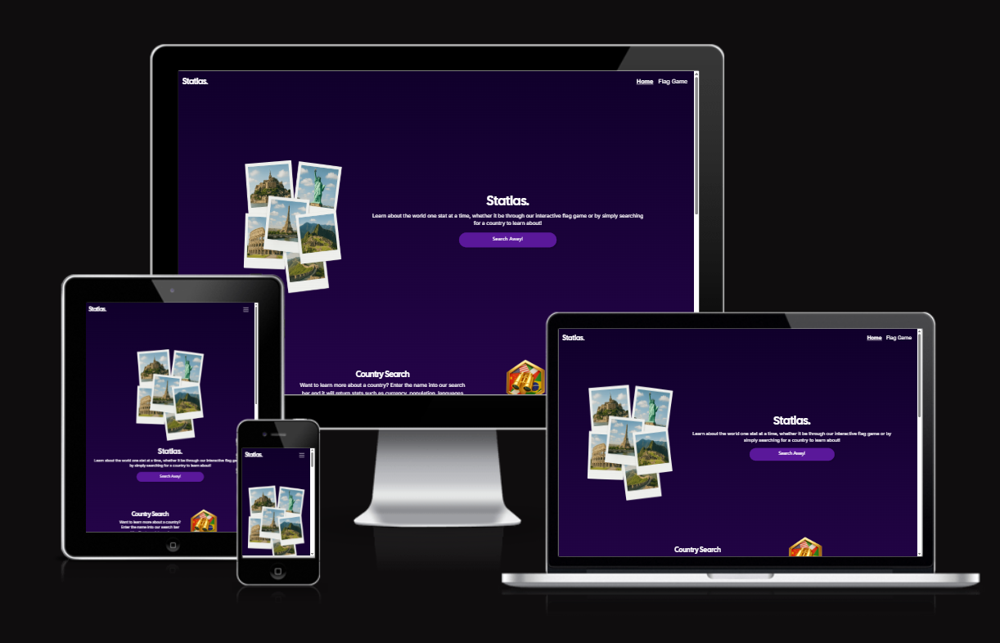
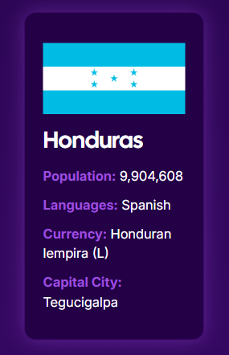
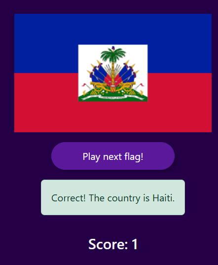
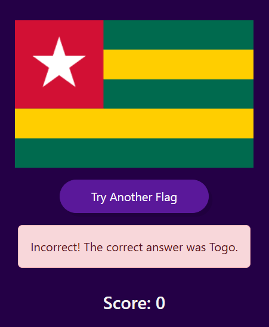
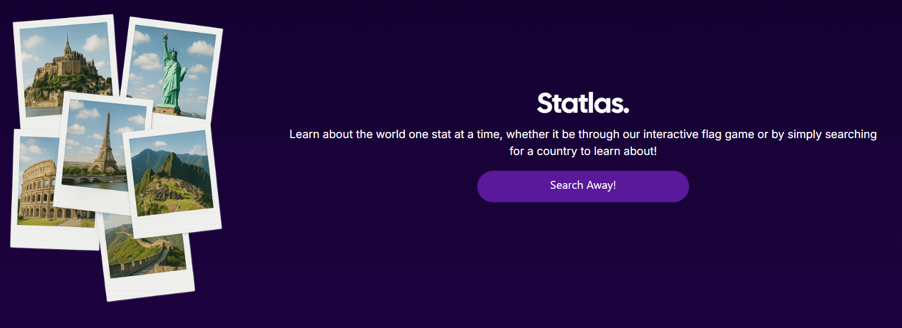
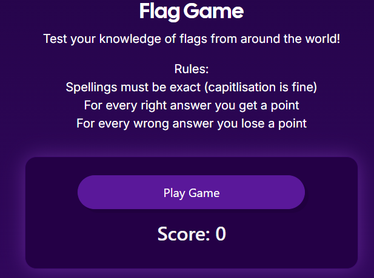
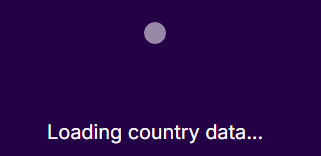
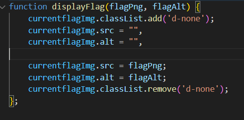
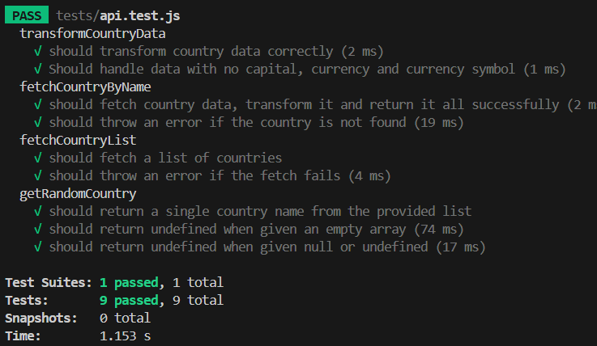

# **Statlas - What is this project?**

This project has been developed to advocate for learning about countries around the world. It gameifies learning about flags, allows users to serch for countries and learn key stats or simply choose the randomise option to get stats for a random country.
  
You can visit the deployed site [here.](https://bhcgh92.github.io/milestone-project-2-statlas/)

## Table of Contents
1. [User Stories](#user-stories---inspiration-for-project)
2. [Branding](#branding--)\
        2.1 [Colour Theme](#colour-theme)  
        2.2 [Fonts](#fonts)  
        2.3 [Wireframes](#wireframes)  
3. [Features & File Structure](#features--file-structure)\
        3.1 [Home Page](#home-page-indexhtml-features)\
        3.2 [Flag Game](#flag-game-page-flaggamehtml)
4. [Languages & Frameworks](#languages--frameworks)\
        4.1 [Languages](#languages)\
        4.2 [Frameworks & Other tools](#frameworks-and-other-tools)
5. [Testing](#testing)\
        5.1 [Manual Testing](#manual-testing)\
        5.2 [HTML Validation](#html-validation)\
        5.3 [CSS Validation](#css-validation)\
        5.4 [JEST Testing](#jest-testing)\
        5.5 [Lighthouse Testing](#lighthouse-testing)\
        5.6 [ESLint](#eslint)
6. [Deployment](#deployment)
7. [Credits](#credits)\
        7.1 [Content](#content)\
        7.2 [API Endpoints](#api-endpoints)\
        7.3 [Imagery](#imagery)\
        7.4 [Code](#code)

## User Stories - Inspiration for project

- **User Story 1: "As a user I want an easy to navigate and vibrant looking website where I can search by country name for information"**\
    _A nice, clean navigation bar with two options will allow the user to navigate to any page from any page. The bar is also sticky so it will follow the user down the page but will not interfere with the users experience. There is a country search bar on the home page that allows the user to enter a country name and this creates a modern looking country card with useful country information._
    - A responsive nav bar, well designed so it works on any device, transparent to start but changes colour on scroll.
    - All pages are reachable from one another.
    - Intuitively designed search bar with one click search.
    - Visible loader inbetween searches to make sure the user knows it's searching.
    - Country information displayed in a clear and concise manner.\
    \
    *The navigation bar in its default, stationary state.*
    \
    *The navigation bar changes colour after the user starts scrolling.*
    \
    *The country search bar on the home page.*
    \
    *The generated country card displaying key information.*\
    

- **User Story 2: "As a user I want to be able to learn about countries without providing an example, I want to be able to look at random countries"**\
    _A nice, clean process of clicking a randomise button and I get country information without providing a country name._
    - An easy to use randomise button, one click and it returns a country card.
    - Visible loader inbetween randomising to make sure the user knows it's searching.
    - Resuable and it keeps returning countries on a random basis.\
    \
    *The country search bar with randomise button. Just press randomise without a country value.*
    

- **User Story 3: "As a user I want to be able to play a game where a random flag pops up and I guess the country name"**\
    _A nice, clean game where a flag is shown and then you get to guess the country, if correct you get a point, if it's incorrect you lose a point._
    - An easy to play game with an incrementing score.
    - Visible loader inbetween flags to make sure the user knows the games working.\

- **User Story 4: "Consistent design througout the website, brand colours, nav bar and footer"**\
    _A nice, clean looking website with consistent colours, fonts, nav bar and footer._
    - An nicely designed website with consistent colours.
    - An nicely designed website with consistent nav bar and footer.\
    \
    *The navigation bar in its default, stationary state.*
    \
    *The navigation bar changes colour after the user starts scrolling.*
    \
    *The footer consistent throughout the site.*
    

- **User Story 5: "A fun, interactive and simple game for users to learn about country flags"**\
    _A nice, simple gain where a right answer gives you a point and a wrong answer decreases your score._
    - Easy to play game, press play and guess.
    - Earn and lost points based on your answer.\
    \
    *Initial game stage before guesses.*\
    \
    *Correct Guess.*\
    \
    *Incorrect Guess.*\
    

[Back To Table Of Contents](#table-of-contents)

## Branding -

### Colour Theme
---

Website colours are below, they consist of multiple shades of purple and white. Colours have been selected for good contrast and easy readability.\
\

All colours were ran through a contrast checker [here](https://www.siegemedia.com/contrast-ratio#).

Colours are referred to their value I've assigned them in the root of my css file. I've included the description on the lowest colour combination (Lavender Vs White) to show that all of my colours have great contrast.

**Dark purple/navy Vs White**\

**Deep purple Vs White**\

**Dark purple Vs White**\

**Magenta Vs White**\

**Lavender Vs White**\

### Fonts
---

For my titles I've used Cal Sans and for my generic text font throughout the site, I've used Inter.

Cal Sans can be found here:\
https://fonts.google.com/specimen/Cal+Sans

Inter can be found here:\
https://fonts.google.com/specimen/Inter

### Wireframes
---

[Back To Table Of Contents](#table-of-contents)

## Features & File Structure

### Sitewide Features
---

- Responsive design to fit all devices.

- Consistant colour theme used across the site.

- Navigation bar consistent throughout the site:

- Footer is consisten throughout the site with contact and address details:

- Consistent hero image at the top of the page with relevant text:

### Home Page (index.html) Features  
---

- Home page has all of the sitewide features.

- Information section highlighting the site features

- Country search and randomiser bar

### Flag Game Page (flaggame.html)  
---

- Home page has all of the sitewide features.

- Flag Game Section.\

### File Structure
---
 
- HTML Files have been saved in the root (Index.html & Flaggame.html).
- JEST & Babel Config files have been saved in the root (jest.config.js & babel.config.js).
- I have few JS files structured in a clear way: 
    - api.js -> Covers all things when it comes to functions with regards to calling and transforming api data.
    - ui.js -> Covers all things to do with functions that change the display for the user.
    - main.js -> Manages api.js and ui.js.
- scripts.js -> Handles small site wide scripts, for this site, it's just the nav scroll effects.
- flaggame.js -> Manages all functions regarding the flagggame, it also makes use of api.js to stop the doubling up of functions.

[Back To Table Of Contents](#table-of-contents)

## Languages & Frameworks

### Languages
---

- [HTML5](https://en.wikipedia.org/wiki/HTML5)
- [CSS3](https://en.wikipedia.org/wiki/CSS)
- [Javascript](https://en.wikipedia.org/wiki/JavaScript)

### Frameworks and other tools
---

- [Bootstrap](https://getbootstrap.com/) - Used to help style the website.
- [Jest - JS Testing Framework](https://jestjs.io/) - Used to write automated tests.
- [Rest Countries](https://restcountries.com/) - Rest countries API.
- [Google Fonts](https://fonts.google.com/) - Imported primary and secondary fonts.
- [Visual Studio Code](https://code.visualstudio.com/) - IDE used to code.
- [Github](https://github.com/) - Holds my repositories and deployed site using Github Pages.
- [Balsamiq](https://balsamiq.com/) - Used to create wireframes.
- [AmIResponsive](https://ui.dev/amiresponsive) - Used to create Mockup image.
- [Tinypng](https://tinypng.com/) - Used for image omptimisation.
- [Canva](https://www.canva.com/) - Used to produce images.
- [ChatGPT](https://chatgpt.com/) - Used to troubleshoot coding issues.
- [Sora - ChatGPT](https://sora.chatgpt.com/explore) - Used to generate feature images.
- [Chrome Dev Tools](https://developer.chrome.com/docs/devtools) - Used for testing and repsonsive behaviour when designing.
- [W3C HTML Validator](https://validator.w3.org/#validate_by_input) - Used for validating my html files.
- [W3C CSS Validator](https://jigsaw.w3.org/css-validator/#validate_by_input) - Used for validating my CSS file.
- [ESlint](https://eslint.org/) - Used inplace of JSLint as it's less rigid but is well known and widely used.

[Back To Table Of Contents](#table-of-contents)

## Testing

### Manual Testing
---

I've ran manual tests on the country search, randomiser and flag game. No errors we're found. I did manually fix an issue where the search functionality uses an exact match as it was returning wrong values when certain values we're mispelt.

I also found a way to cheat the game, if you inspected the page on the flag game, the alt text still retained the country name from the API result, therefore people who had the knowledge to check could have inspected the page and cheated. It also made the game inaccessible for people using screen readers.

I added the followng code in the startNewRound function in my flaggame.js file so that it would take the country name, convert it into a regular expression and then find and replace that expression within the alt text returned via the api.After learning how to go about this the best way I learned that using a regular experession with boundaries would be a great soultion and that escapeRegex was a widely used function name for this type of function.\

It was also brought to my attention that when manual testing was taking place, my opinion was that the spinner-grow class was a clear indicator that something was loading but it was fed back to me that was not the case, so I added text to the loaders on the search, randomiser and flag game.

Another issue that I found whislt manually testing the game was that when I was playing, I noticed that when I was loading a new flag into the space, the old one would show for a second or two (dependent on internet speed), making it confusing until the new flag loaded. I added in three lines one to hide the flag so the old one didn't show, and then another two lines to reset the flag png and alt text to be blank.

    
### HTML Validation
---

Index HTML - Passed with no warnings or errors.\

Flag Game HTML - Passed with two seperate.
 - src warning was resolved by removing extra html that was needed.
 - type='module' and defer are being used in conjuction with one another to allow my JS to run correctly for my flag game.

### CSS Validation
---

CSS sheet has been validated with no errors:\

### JEST Testing
---

JEST Tests have been written for APIs and Flag Game basic functionality

Api.test.js -> Tests were written to test core functionality:\

Flaggame.test.js  -> Tests were written to test basic functionality:\

### Lighthouse Testing
---

Index.html -> Performance was around 75 due to images, I have already optimised them as much as possible:\

Flaggame.html -> Performance was around 75 due to images, I have already optimised them as much as possible:\
 

### ESLint 
---

I used ESLint as this is more of an Industry standard, rather than JSLint as it quites rigid. I am using the JS recommended setup for ESLint that can be found [here](https://eslint.org/docs/latest/rules/), anything with a green tick is included in the recommended setup. You can run ESlint on a particular folder or on a file by file basis.

These were the initial errors ESLint flagged:\

I then resolved all of these errors and now ESLint does not flag any errors or warnings.

[Back To Table Of Contents](#table-of-contents)

## Deployment

Website has been deployed via github Pages.

Steps taken to deploy:

- Access the github repository  
- Click Settings  
- Click Pages on the left hand side menu  
- Deploy from branch was chosen  
- Main branch was selected to deploy from  
- Give it time and it generates a link to the deployed site.

[Back To Table Of Contents](#table-of-contents)

## Credits

### Content
---

All content was either written by the developer or produced via chatgpt prompts.

### API Endpoints
---

Rest Countries which can be found [here](https://restcountries.com/).

It has been used for all key parts of my project "Country Search", "Randomise" and "Flag Game". It is a free endpoint that does accept donations to keep up with server costs. 

### Imagery
---

All imagery was produced by the developer via Canva or via Sora (ChatGPT imagery).

### Code
---

All code was either written by the developer or taken and amended from bootstrap. Some code was discussed with ChatGPT to troubleshoot certain issues.

[Back To Table Of Contents](#table-of-contents)